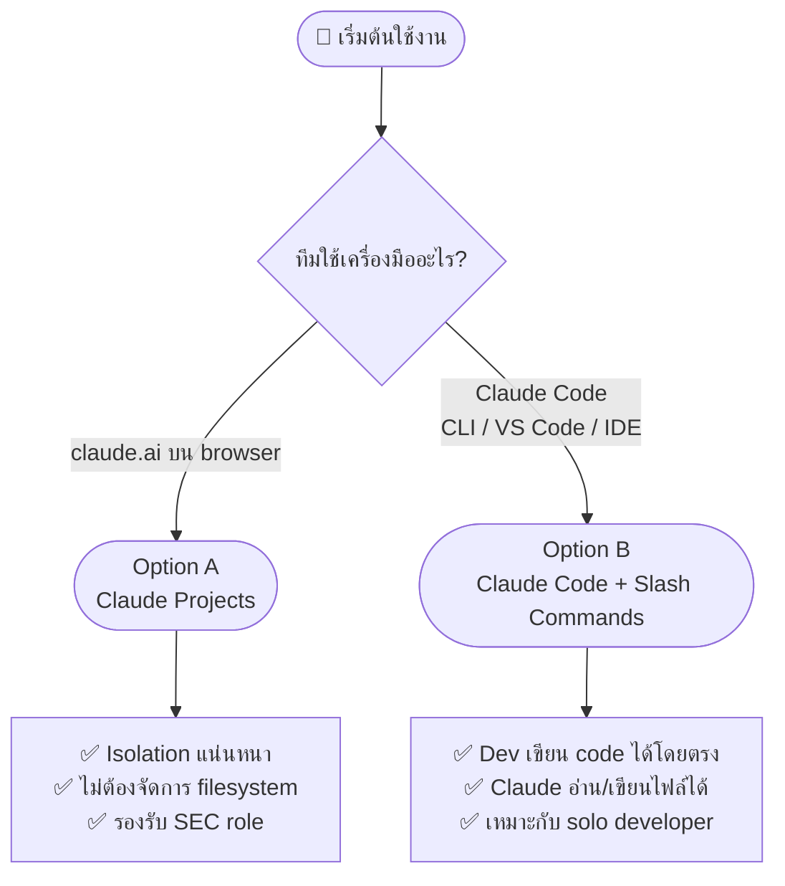
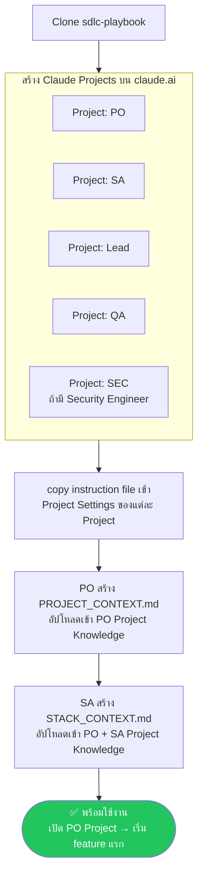
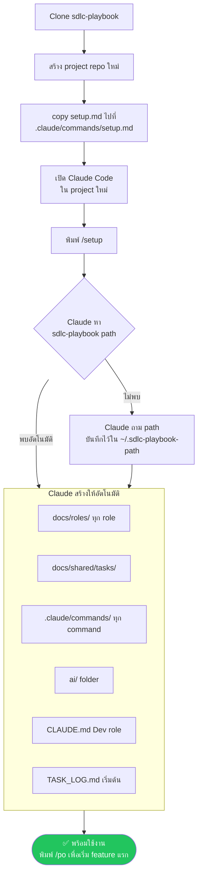
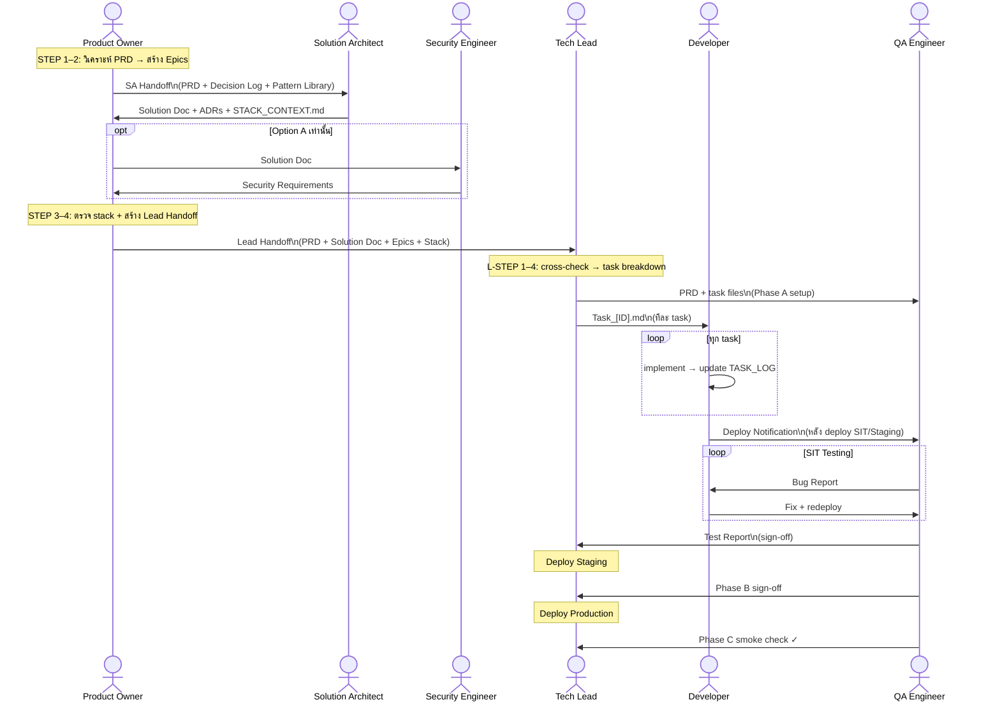
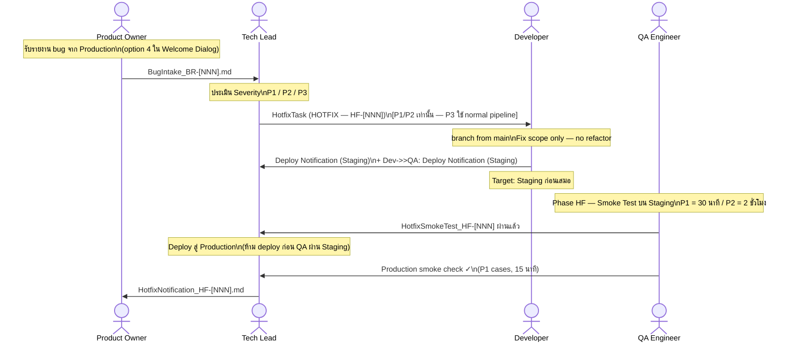
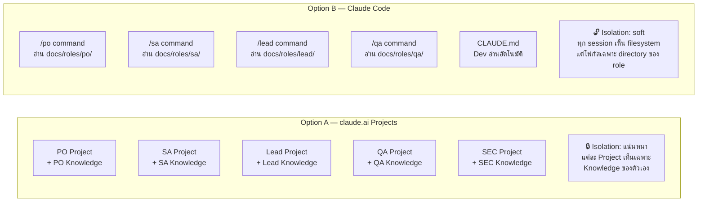
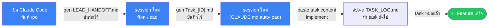

# SDLC Playbook — Workflow Overview

ภาพรวมการทำงานและการติดตั้ง SDLC Playbook สำหรับทีม

---

## 1. เลือก Option



---

## 2. Option A — Setup Flow (claude.ai Projects)



### Instruction file ต่อ Project

| Claude Project | ใช้ไฟล์ | ผู้ใช้ |
|---|---|---|
| `[Project] — PO` | `ai/PROJECT_INSTRUCTIONS.md` | Product Owner |
| `[Project] — SA` | `ai/SA_PROJECT_INSTRUCTIONS.md` | Solution Architect |
| `[Project] — Lead` | `ai/LEAD_PROJECT_INSTRUCTIONS.md` | Tech Lead |
| `[Project] — QA` | `ai/QA_PROJECT_INSTRUCTIONS.md` | QA Engineer |
| `[Project] — SEC` | `ai/SEC_PROJECT_INSTRUCTIONS.md` | Security Engineer |

> **Dev ไม่ใช้ claude.ai Project** — Dev ใช้ Claude Code กับ `ai/DEV_PROJECT_INSTRUCTIONS.md` เสมอ

---

## 3. Option B — Setup Flow (Claude Code)



### Slash Commands หลัง Setup

| Command | Role | ทำอะไร |
|---|---|---|
| `/setup` | — | สร้าง directory structure + copy ไฟล์ทั้งหมด (ทำครั้งเดียว) |
| `/po` | Product Owner | วิเคราะห์ PRD, สร้าง handoff ให้ SA และ Lead |
| `/sa` | Solution Architect | ออกแบบ solution, สร้าง ADR, STACK_CONTEXT |
| `/lead` | Tech Lead | แตก task, สร้าง Task files และ CLAUDE.md |
| `/qa` | QA Engineer | เขียน test cases, รัน test, รายงานผล |
| _(ไม่ต้องพิมพ์)_ | Developer | Claude อ่าน CLAUDE.md อัตโนมัติ |

---

## 4. SDLC Workflow — Role ต่อ Role



---

## 4b. Hotfix Flow — Production Bug



---

## 5. Artifact Flow — ไฟล์ไหลไปที่ไหน

```mermaid
flowchart LR
    subgraph PO_zone[PO Knowledge]
        PRD[PRD]
        DL[DECISION_LOG]
        PL[PATTERN_LIBRARY]
        PC[PROJECT_CONTEXT]
        SC_PO[STACK_CONTEXT\nreplica]
    end

    subgraph SA_zone[SA Knowledge]
        SC[STACK_CONTEXT\nต้นฉบับ]
        SOL[Solution_Doc]
        ADR[ADR files]
    end

    subgraph Lead_zone[Lead Knowledge]
        LH[LEAD_HANDOFF]
        TF[Task_[ID].md files]
        CM[CLAUDE.md]
    end

    subgraph Shared[Shared — ทุก role เห็น]
        TASKS[tasks/]
        TL[TASK_LOG.md]
    end

    subgraph Dev_zone[Dev workspace]
        CODE[source code]
    end

    subgraph QA_zone[QA Knowledge]
        TC[TestCases]
        BR[BugReports]
        TR[TestReport]
    end

    SC -->|SA copy ให้| SC_PO
    PRD & DL & PL & SC_PO & SOL --> LH
    LH --> TF
    TF --> TASKS
    TASKS --> CODE
    CODE --> TL
    TL --> QA_zone
    TASKS --> QA_zone
```

---

## 6. Option A vs Option B — เปรียบเทียบ



| | Option A | Option B |
|--|--|--|
| **เครื่องมือ** | claude.ai (browser) | Claude Code (CLI/IDE) |
| **Isolation** | แน่นหนา (Project Knowledge แยกกัน) | Soft (slash command กำหนด scope) |
| **Dev workflow** | ต้องใช้ Claude Code แยกต่างหาก | ใช้ Claude Code ตลอด |
| **SEC role** | รองรับ | ไม่รองรับ (embedded ใน SA/Lead/QA) |
| **Solo developer** | ยุ่งยาก (หลาย browser tabs) | เหมาะ (slash commands ใน terminal เดียว) |
| **Setup** | สร้าง Claude Projects บน claude.ai | รัน `/setup` ครั้งเดียว |

---

## 7. Solo Developer — Minimum Flow



> ดูรายละเอียดเพิ่มเติมที่ [docs/guides/SOLO_GUIDE.md](guides/SOLO_GUIDE.md)
