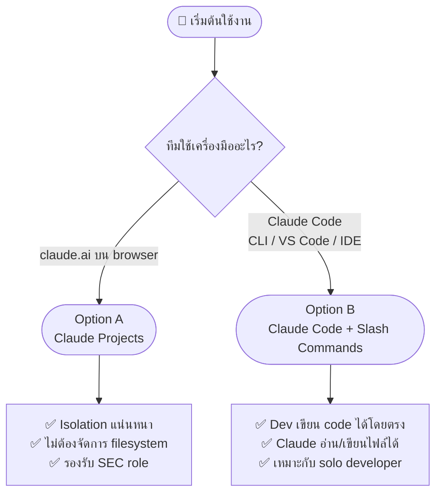
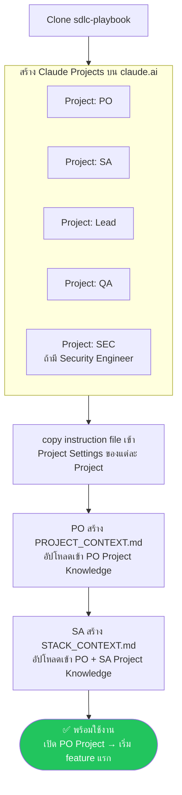
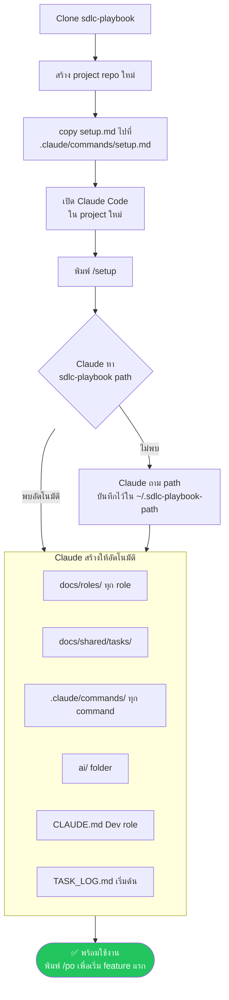
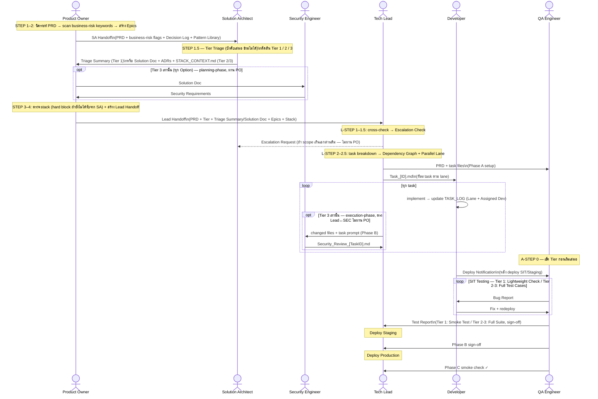
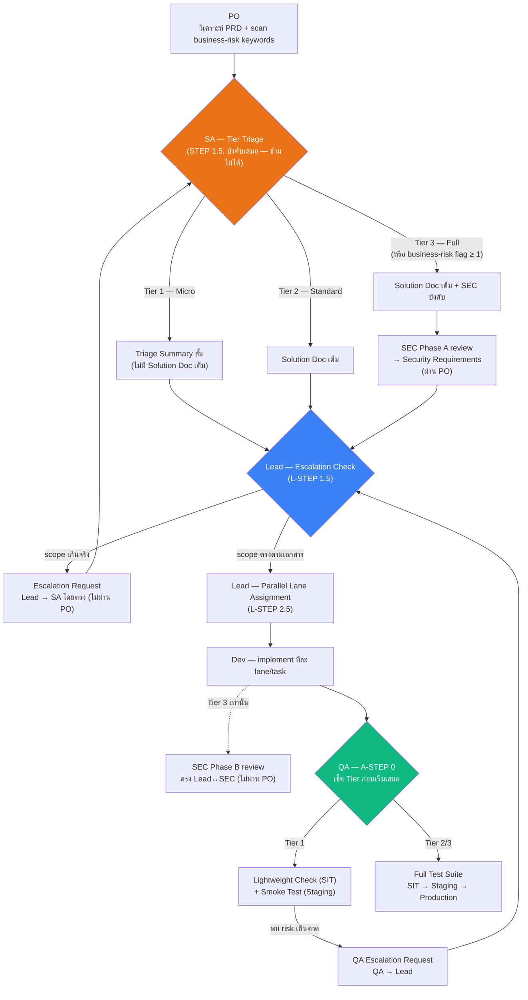
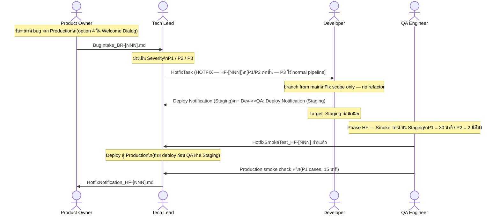
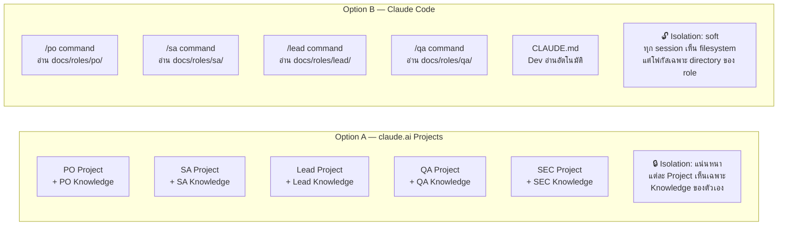

# SDLC Playbook — Workflow Overview

ภาพรวมการทำงานและการติดตั้ง SDLC Playbook สำหรับทีม

---

## 1. เลือก Option

```mermaid
flowchart TD
    START([🚀 เริ่มต้นใช้งาน]) --> Q1{ทีมใช้เครื่องมืออะไร?}

    Q1 -->|claude.ai บน browser| A
    Q1 -->|Claude Code\nCLI / VS Code / IDE| B

    A([Option A\nClaude Projects])
    B([Option B\nClaude Code + Slash Commands])

    A --> A_PRO["✅ Isolation แน่นหนา\n✅ ไม่ต้องจัดการ filesystem\n✅ รองรับ SEC role"]
    B --> B_PRO["✅ Dev เขียน code ได้โดยตรง\n✅ Claude อ่าน/เขียนไฟล์ได้\n✅ เหมาะกับ solo developer"]
```

---

## 2. Option A — Setup Flow (claude.ai Projects)

```mermaid
flowchart TD
    A1[Clone sdlc-playbook] --> A2

    subgraph A2[สร้าง Claude Projects บน claude.ai]
        direction LR
        PO_P[Project: PO]
        SA_P[Project: SA]
        LD_P[Project: Lead]
        QA_P[Project: QA]
        SEC_P[Project: SEC\nถ้ามี Security Engineer]
    end

    A2 --> A3[copy instruction file เข้า\nProject Settings ของแต่ละ Project]
    A3 --> A4[PO สร้าง PROJECT_CONTEXT.md\nอัปโหลดเข้า PO Project Knowledge]
    A4 --> A5[SA สร้าง STACK_CONTEXT.md\nอัปโหลดเข้า PO + SA Project Knowledge]
    A5 --> A6([✅ พร้อมใช้งาน\nเปิด PO Project → เริ่ม feature แรก])

    style A6 fill:#22c55e,color:#fff
```

### Instruction file ต่อ Project

| Claude Project | ใช้ไฟล์ | ผู้ใช้ |
|---|---|---|
| `[Project] — PO` | `ai/PROJECT_INSTRUCTIONS.md` | Product Owner |
| `[Project] — SA` | `ai/SA_PROJECT_INSTRUCTIONS.md` | Solution Architect |
| `[Project] — Lead` | `ai/LEAD_PROJECT_INSTRUCTIONS.md` | Tech Lead |
| `[Project] — QA` | `ai/QA_PROJECT_INSTRUCTIONS.md` | QA Engineer |
| `[Project] — SEC` | `ai/SEC_PROJECT_INSTRUCTIONS.md` | Security Engineer |

> **Dev ไม่ใช้ claude.ai Project** — Dev ใช้ Claude Code กับ `ai/DEV_PROJECT_INSTRUCTIONS.md` เสมอ

---

## 3. Option B — Setup Flow (Claude Code)

```mermaid
flowchart TD
    B1[Clone sdlc-playbook] --> B2[สร้าง project repo ใหม่]
    B2 --> B3["copy setup.md ไปที่\n.claude/commands/setup.md"]
    B3 --> B4["เปิด Claude Code\nใน project ใหม่"]
    B4 --> B5["พิมพ์ /setup"]

    B5 --> B6{Claude หา\nsdlc-playbook path}
    B6 -->|พบอัตโนมัติ| B7
    B6 -->|ไม่พบ| B6B[Claude ถาม path\nบันทึกไว้ใน ~/.sdlc-playbook-path]
    B6B --> B7

    subgraph B7[Claude สร้างให้อัตโนมัติ]
        direction LR
        D1[docs/roles/ ทุก role]
        D2[docs/shared/tasks/]
        D3[.claude/commands/ ทุก command]
        D4[ai/ folder]
        D5[CLAUDE.md Dev role]
        D6[TASK_LOG.md เริ่มต้น]
    end

    B7 --> B8([✅ พร้อมใช้งาน\nพิมพ์ /po เพื่อเริ่ม feature แรก])

    style B8 fill:#22c55e,color:#fff
```

### Slash Commands หลัง Setup

| Command | Role | ทำอะไร |
|---|---|---|
| `/setup` | — | สร้าง directory structure + copy ไฟล์ทั้งหมด (ทำครั้งเดียว) |
| `/po` | Product Owner | วิเคราะห์ PRD, สร้าง handoff ให้ SA และ Lead |
| `/sa` | Solution Architect | ออกแบบ solution, สร้าง ADR, STACK_CONTEXT |
| `/lead` | Tech Lead | แตก task, สร้าง Task files และ CLAUDE.md |
| `/qa` | QA Engineer | เขียน test cases, รัน test, รายงานผล |
| _(ไม่ต้องพิมพ์)_ | Developer | Claude อ่าน CLAUDE.md อัตโนมัติ |

---

## 4. SDLC Workflow — Role ต่อ Role

```mermaid
sequenceDiagram
    actor PO as Product Owner
    actor SA as Solution Architect
    actor SEC as Security Engineer
    actor Lead as Tech Lead
    actor Dev as Developer
    actor QA as QA Engineer

    Note over PO: STEP 1–2: วิเคราะห์ PRD → scan business-risk keywords → สร้าง Epics

    PO->>SA: SA Handoff\n(PRD + business-risk flags + Decision Log + Pattern Library)
    Note over SA: STEP 1.5 — Tier Triage (บังคับเสมอ ข้ามไม่ได้)\nตัดสิน Tier 1 / 2 / 3
    SA->>PO: Triage Summary (Tier 1)\nหรือ Solution Doc + ADRs + STACK_CONTEXT.md (Tier 2/3)

    opt Tier 3 เท่านั้น (ทุก Option) — planning-phase, ผ่าน PO
        PO->>SEC: Solution Doc
        SEC->>PO: Security Requirements
    end

    Note over PO: STEP 3–4: ตรวจ stack (hard block ถ้ายังไม่ได้รับจาก SA) + สร้าง Lead Handoff
    PO->>Lead: Lead Handoff\n(PRD + Tier + Triage Summary/Solution Doc + Epics + Stack)

    Note over Lead: L-STEP 1–1.5: cross-check → Escalation Check
    Lead-->>SA: Escalation Request (ถ้า scope เกินเอกสารเดิม — ไม่ผ่าน PO)
    Note over Lead: L-STEP 2–2.5: task breakdown → Dependency Graph + Parallel Lane
    Lead->>QA: PRD + task files\n(Phase A setup)
    Lead->>Dev: Task_[ID].md\n(ทีละ task ตาม lane)

    loop ทุก task
        Dev->>Dev: implement → update TASK_LOG (Lane + Assigned Dev)
        opt Tier 3 เท่านั้น — execution-phase, ตรง Lead↔SEC ไม่ผ่าน PO
            Lead->>SEC: changed files + task prompt (Phase B)
            SEC->>Lead: Security_Review_[TaskID].md
        end
    end

    Note over QA: A-STEP 0 — เช็ค Tier ก่อนเริ่มเสมอ
    Dev->>QA: Deploy Notification\n(หลัง deploy SIT/Staging)

    loop SIT Testing — Tier 1: Lightweight Check / Tier 2-3: Full Test Cases
        QA->>Dev: Bug Report
        Dev->>QA: Fix + redeploy
    end

    QA->>Lead: Test Report\n(Tier 1: Smoke Test / Tier 2-3: Full Suite, sign-off)
    Note over Lead: Deploy Staging
    QA->>Lead: Phase B sign-off
    Note over Lead: Deploy Production
    QA->>Lead: Phase C smoke check ✓
```

> Routing pattern (ทำไม Phase A ผ่าน PO แต่ Phase B ตรง Lead↔SEC) → ดูหลักการเต็มที่ [CORE_POLICY.md](CORE_POLICY.md) §6

---

## 4a. Tier & Escalation Overview

**ใช้ได้ทั้ง Solo และ Enterprise mode** — policy เดียวกันทุกตัวอักษร ต่างกันแค่ mechanics การส่งต่อ (Solo = คนเดียวสลับ session, Enterprise = คนละ role จริง) ดู [CORE_POLICY.md](CORE_POLICY.md)

```mermaid
flowchart TD
    PO["PO\nวิเคราะห์ PRD + scan business-risk keywords"] --> SA_T{"SA — Tier Triage\n(STEP 1.5, บังคับเสมอ — ข้ามไม่ได้)"}

    SA_T -->|Tier 1 — Micro| T1["Triage Summary สั้น\n(ไม่มี Solution Doc เต็ม)"]
    SA_T -->|Tier 2 — Standard| T2["Solution Doc เต็ม"]
    SA_T -->|"Tier 3 — Full\n(หรือ business-risk flag ≥ 1)"| T3["Solution Doc เต็ม + SEC บังคับ"]

    T3 --> SEC["SEC Phase A review\n→ Security Requirements\n(ผ่าน PO)"]

    T1 --> Lead_E{"Lead — Escalation Check\n(L-STEP 1.5)"}
    T2 --> Lead_E
    SEC --> Lead_E

    Lead_E -->|scope เกินจริง| ESC["Escalation Request\nLead → SA โดยตรง (ไม่ผ่าน PO)"]
    ESC --> SA_T
    Lead_E -->|scope ตรงตามเอกสาร| Lane["Lead — Parallel Lane Assignment\n(L-STEP 2.5)"]

    Lane --> Dev["Dev — implement ทีละ lane/task"]
    Dev -.->|Tier 3 เท่านั้น| SEC_B["SEC Phase B review\nตรง Lead↔SEC (ไม่ผ่าน PO)"]

    Dev --> QA_T{"QA — A-STEP 0\nเช็ค Tier ก่อนเริ่มเสมอ"}
    QA_T -->|Tier 1| QA1["Lightweight Check (SIT)\n+ Smoke Test (Staging)"]
    QA_T -->|Tier 2/3| QA23["Full Test Suite\nSIT → Staging → Production"]

    QA1 -->|พบ risk เกินคาด| QESC["QA Escalation Request\nQA → Lead"]
    QESC --> Lead_E

    style SA_T fill:#e97316,color:#fff
    style Lead_E fill:#3b82f6,color:#fff
    style QA_T fill:#10b981,color:#fff
```

**หมายเหตุ:**
- SA Tier Triage ข้ามไม่ได้ในทุกกรณี — แม้ solo dev คนเดียวก็ต้องผ่าน SA session (ดู [SOLO_GUIDE.md](guides/SOLO_GUIDE.md))
- PO ไม่ตัดสิน tier — ทำได้แค่ flag business-risk keyword เป็น context ให้ SA
- Lead escalate ตรงไป SA เมื่อพบ scope เกินขอบเขต Triage Summary/Solution Doc เดิม (ไม่ผ่าน PO)
- Parallel Lane Assignment แยกงานเป็น lane ตาม domain สำหรับ task ที่ไม่มี dependency/file overlap กัน — solo ที่ไม่มี dev คนที่สองข้าม step นี้ได้
- QA อ่าน `Tier:` จาก Solution Doc/Triage Summary header ที่ A-STEP 0 เสมอ — Tier 1 ใช้ Lightweight Check + Smoke Test แทนชุดเต็ม, Tier 2/3 ไม่เปลี่ยนอะไรเลย
- QA Tier Escalation ผูกกับ Lead's Escalation Check เดิม (L-STEP 1.5) ไม่ใช่กลไกแยกลอย
- Planning-phase (ผ่าน PO) vs execution-phase (ตรงระหว่าง role ปฏิบัติการ) เป็นหลักการเดียวกันทั่วระบบ — ดู [CORE_POLICY.md](CORE_POLICY.md) §6

---

## 4b. Hotfix Flow — Production Bug

```mermaid
sequenceDiagram
    actor PO as Product Owner
    actor Lead as Tech Lead
    actor Dev as Developer
    actor QA as QA Engineer

    Note over PO: รับรายงาน bug จาก Production\n(option 4 ใน Welcome Dialog)
    PO->>Lead: BugIntake_BR-[NNN].md

    Note over Lead: ประเมิน Severity\nP1 / P2 / P3
    Lead->>Dev: HotfixTask (HOTFIX — HF-[NNN])\n[P1/P2 เท่านั้น — P3 ใช้ normal pipeline]

    Note over Dev: branch from main\nFix scope only — no refactor

    Dev->>Lead: Deploy Notification (Staging)\n+ Dev->>QA: Deploy Notification (Staging)
    Note over Dev: Target: Staging ก่อนเสมอ

    Note over QA: Phase HF — Smoke Test บน Staging\nP1 = 30 นาที / P2 = 2 ชั่วโมง
    QA->>Lead: HotfixSmokeTest_HF-[NNN] ผ่านแล้ว

    Note over Lead: Deploy สู่ Production\n(ห้าม deploy ก่อน QA ผ่าน Staging)

    QA->>Lead: Production smoke check ✓\n(P1 cases, 15 นาที)

    Lead->>PO: HotfixNotification_HF-[NNN].md
```

---

## 5. Artifact Flow — ไฟล์ไหลไปที่ไหน

```mermaid
flowchart LR
    subgraph PO_zone[PO Knowledge]
        PRD[PRD]
        DL[DECISION_LOG]
        PL[PATTERN_LIBRARY]
        PC[PROJECT_CONTEXT]
        SC_PO[STACK_CONTEXT\nreplica]
    end

    subgraph SA_zone[SA Knowledge]
        SC[STACK_CONTEXT\nต้นฉบับ]
        SOL[Solution_Doc]
        ADR[ADR files]
    end

    subgraph Lead_zone[Lead Knowledge]
        LH[LEAD_HANDOFF]
        TF[Task_[ID].md files]
        CM[CLAUDE.md]
    end

    subgraph Shared[Shared — ทุก role เห็น]
        TASKS[tasks/]
        TL[TASK_LOG.md]
    end

    subgraph Dev_zone[Dev workspace]
        CODE[source code]
    end

    subgraph QA_zone[QA Knowledge]
        TC[TestCases]
        BR[BugReports]
        TR[TestReport]
    end

    SC -->|SA copy ให้| SC_PO
    PRD & DL & PL & SC_PO & SOL --> LH
    LH --> TF
    TF --> TASKS
    TASKS --> CODE
    CODE --> TL
    TL --> QA_zone
    TASKS --> QA_zone
```

---

## 6. Option A vs Option B — เปรียบเทียบ

```mermaid
flowchart LR
    subgraph OA[Option A — claude.ai Projects]
        direction TB
        OA1[PO Project\n+ PO Knowledge]
        OA2[SA Project\n+ SA Knowledge]
        OA3[Lead Project\n+ Lead Knowledge]
        OA4[QA Project\n+ QA Knowledge]
        OA5[SEC Project\n+ SEC Knowledge]
        OA_ISO["🔒 Isolation: แน่นหนา\nแต่ละ Project เห็นเฉพาะ\nKnowledge ของตัวเอง"]
    end

    subgraph OB[Option B — Claude Code]
        direction TB
        OB1["/po command\nอ่าน docs/roles/po/"]
        OB2["/sa command\nอ่าน docs/roles/sa/"]
        OB3["/lead command\nอ่าน docs/roles/lead/"]
        OB4["/qa command\nอ่าน docs/roles/qa/"]
        OB5["CLAUDE.md\nDev อ่านอัตโนมัติ"]
        OB_ISO["🔓 Isolation: soft\nทุก session เห็น filesystem\nแต่โฟกัสเฉพาะ directory ของ role"]
    end
```

| | Option A | Option B |
|--|--|--|
| **เครื่องมือ** | claude.ai (browser) | Claude Code (CLI/IDE) |
| **Isolation** | แน่นหนา (Project Knowledge แยกกัน) | Soft (slash command กำหนด scope) |
| **Dev workflow** | ต้องใช้ Claude Code แยกต่างหาก | ใช้ Claude Code ตลอด |
| **SEC role** | รองรับ | ไม่รองรับ (embedded ใน SA/Lead/QA) |
| **Solo developer** | ยุ่งยาก (หลาย browser tabs) | เหมาะ (slash commands ใน terminal เดียว) |
| **Setup** | สร้าง Claude Projects บน claude.ai | รัน `/setup` ครั้งเดียว |

---

## 7. Solo Developer — Minimum Flow

**SA Tier Triage ข้ามไม่ได้แม้ทำคนเดียว** — Minimum tier ของ solo ยังคงผ่าน SA session เสมอ เพียงแต่ใช้ SA STEP 1.5 Tier Triage แบบสั้น (10-15 นาที) แทน Solution Doc เต็ม ดู [CORE_POLICY.md](CORE_POLICY.md) §1

```mermaid
flowchart LR
    S1["เปิด Claude Code\nพิมพ์ /po"] -->|"gen SA_HANDOFF.md\nบันทึกไว้"| S2
    S2["session ใหม่\nพิมพ์ /sa — Tier Triage"] -->|"gen Triage_Summary.md\n(Tier 1) บันทึกไว้"| S3
    S3["session ใหม่\nพิมพ์ /po ต่อ"] -->|"gen LEAD_HANDOFF.md\nบันทึกไว้"| S4
    S4["session ใหม่\nพิมพ์ /lead"] -->|"gen Task_[ID].md\nบันทึกไว้"| S5
    S5["session ใหม่\n(CLAUDE.md auto-load)"] -->|"paste task content\nimplement"| S6
    S6["อัปเดต TASK_LOG.md\nทำ task ถัดไป"] -->|"task หมดแล้ว"| DONE

    S1:::role
    S2:::role
    S3:::role
    S4:::role
    S5:::role
    DONE([✅ Feature เสร็จ])

    classDef role fill:#3b82f6,color:#fff
    style DONE fill:#22c55e,color:#fff
```

> ถ้า SA ตัดสินว่าเป็น Tier 2/3 → feature นั้นใช้เวลามากกว่านี้ตามปกติของ Solution Doc เต็ม (ไม่ใช่ Minimum flow อีกต่อไป)
> ดูรายละเอียดเพิ่มเติมที่ [docs/guides/SOLO_GUIDE.md](guides/SOLO_GUIDE.md)
