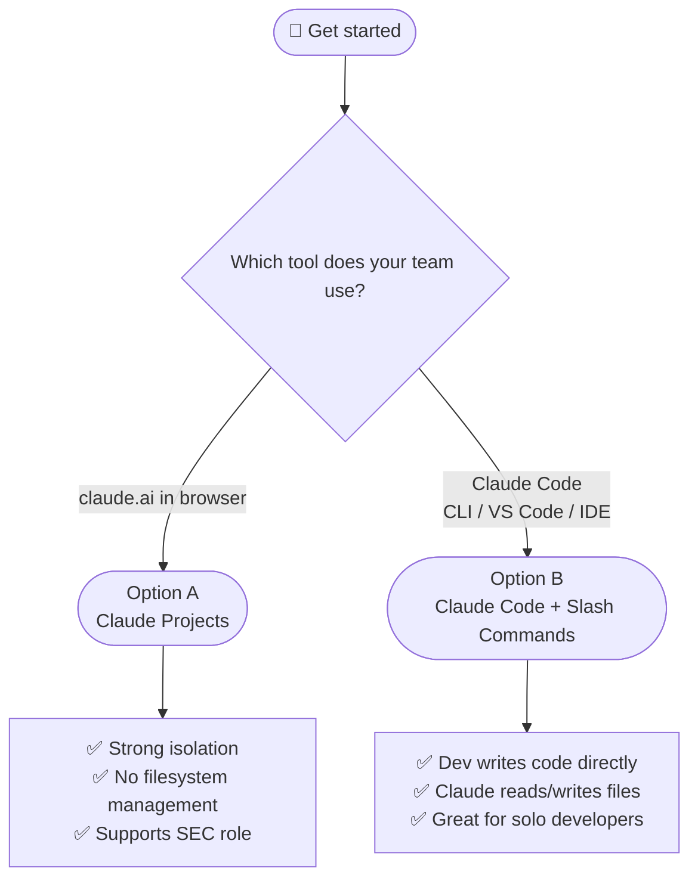
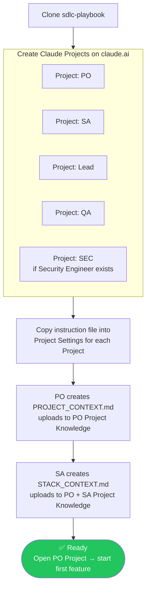
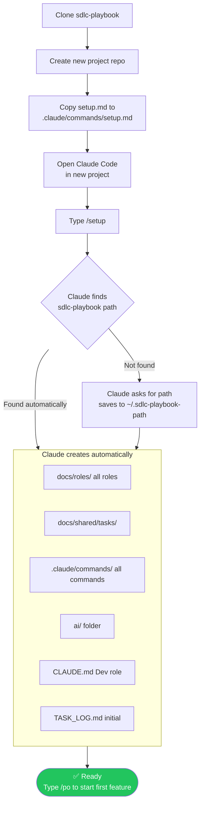
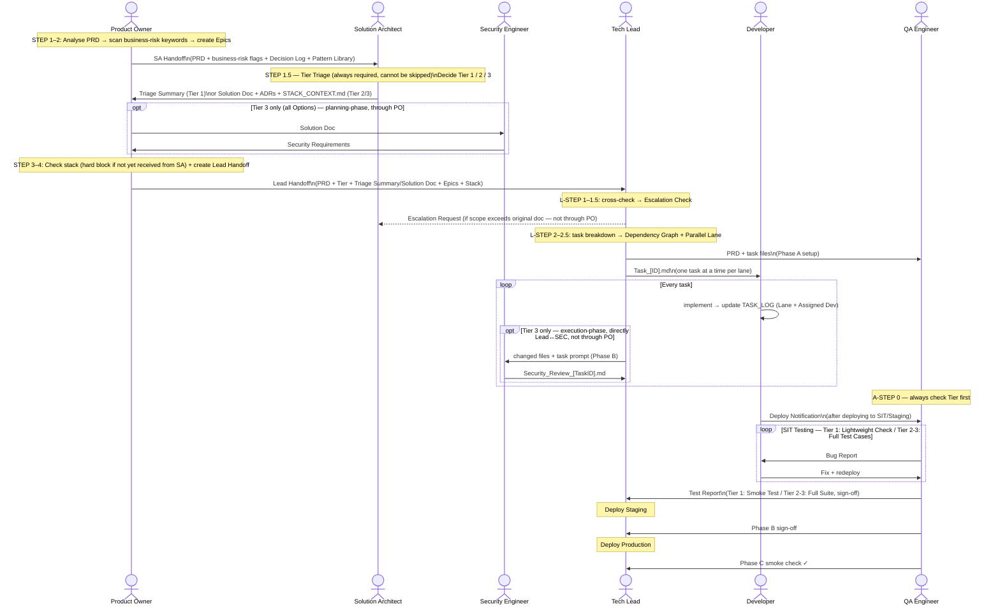
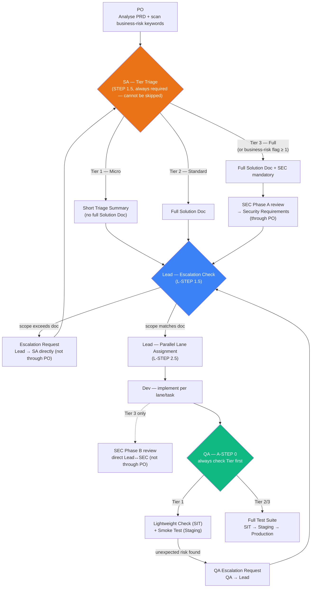
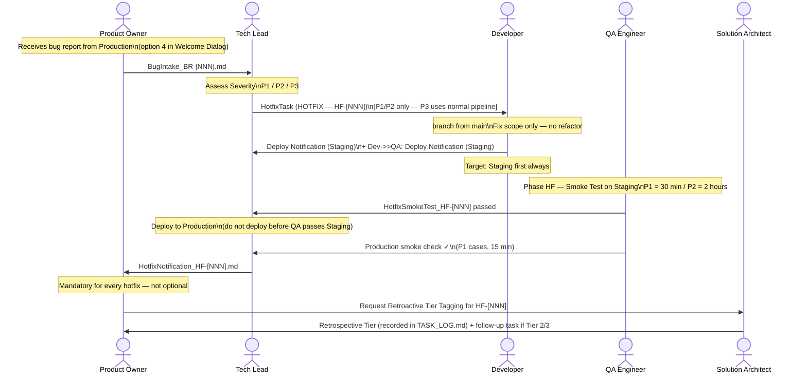
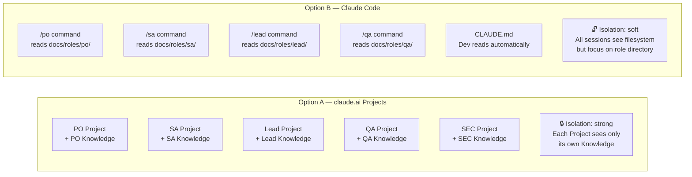

# SDLC Playbook — Workflow Overview

Workflow overview and setup for teams using the SDLC Playbook.

---

## 1. Choose an Option

```mermaid
flowchart TD
    START([🚀 Get started]) --> Q1{Which tool does your team use?}

    Q1 -->|claude.ai in browser| A
    Q1 -->|Claude Code\nCLI / VS Code / IDE| B

    A([Option A\nClaude Projects])
    B([Option B\nClaude Code + Slash Commands])

    A --> A_PRO["✅ Strong isolation\n✅ No filesystem management\n✅ Supports SEC role"]
    B --> B_PRO["✅ Dev writes code directly\n✅ Claude reads/writes files\n✅ Great for solo developers"]
```

---

## 2. Option A — Setup Flow (claude.ai Projects)

```mermaid
flowchart TD
    A1[Clone sdlc-playbook] --> A2

    subgraph A2[Create Claude Projects on claude.ai]
        direction LR
        PO_P[Project: PO]
        SA_P[Project: SA]
        LD_P[Project: Lead]
        QA_P[Project: QA]
        SEC_P[Project: SEC\nif Security Engineer exists]
    end

    A2 --> A3[Copy instruction file into\nProject Settings for each Project]
    A3 --> A4[PO creates PROJECT_CONTEXT.md\nuploads to PO Project Knowledge]
    A4 --> A5[SA creates STACK_CONTEXT.md\nuploads to PO + SA Project Knowledge]
    A5 --> A6([✅ Ready\nOpen PO Project → start first feature])

    style A6 fill:#22c55e,color:#fff
```

### Instruction file per Project

| Claude Project | Uses file | User |
|---|---|---|
| `[Project] — PO` | `ai/PROJECT_INSTRUCTIONS.md` | Product Owner |
| `[Project] — SA` | `ai/SA_PROJECT_INSTRUCTIONS.md` | Solution Architect |
| `[Project] — Lead` | `ai/LEAD_PROJECT_INSTRUCTIONS.md` | Tech Lead |
| `[Project] — QA` | `ai/QA_PROJECT_INSTRUCTIONS.md` | QA Engineer |
| `[Project] — SEC` | `ai/SEC_PROJECT_INSTRUCTIONS.md` | Security Engineer |

> **Dev does not use a claude.ai Project** — Dev always uses Claude Code with `ai/DEV_PROJECT_INSTRUCTIONS.md`

---

## 3. Option B — Setup Flow (Claude Code)

```mermaid
flowchart TD
    B1[Clone sdlc-playbook] --> B2[Create new project repo]
    B2 --> B3["Copy setup.md to\n.claude/commands/setup.md"]
    B3 --> B4["Open Claude Code\nin new project"]
    B4 --> B5["Type /setup"]

    B5 --> B6{Claude finds\nsdlc-playbook path}
    B6 -->|Found automatically| B7
    B6 -->|Not found| B6B[Claude asks for path\nsaves to ~/.sdlc-playbook-path]
    B6B --> B7

    subgraph B7[Claude creates automatically]
        direction LR
        D1[docs/roles/ all roles]
        D2[docs/shared/tasks/]
        D3[.claude/commands/ all commands]
        D4[ai/ folder]
        D5[CLAUDE.md Dev role]
        D6[TASK_LOG.md initial]
    end

    B7 --> B8([✅ Ready\nType /po to start first feature])

    style B8 fill:#22c55e,color:#fff
```

### Slash Commands after Setup

| Command | Role | What it does |
|---|---|---|
| `/setup` | — | Creates directory structure + copies all files (run once) |
| `/po` | Product Owner | Analyse PRD, create handoffs for SA and Lead |
| `/sa` | Solution Architect | Design solution, create ADR, STACK_CONTEXT |
| `/lead` | Tech Lead | Break tasks, create Task files and CLAUDE.md |
| `/qa` | QA Engineer | Write test cases, run tests, report results |
| _(no command needed)_ | Developer | Claude reads CLAUDE.md automatically |

---

## 4. SDLC Workflow — Role by Role

```mermaid
sequenceDiagram
    actor PO as Product Owner
    actor SA as Solution Architect
    actor SEC as Security Engineer
    actor Lead as Tech Lead
    actor Dev as Developer
    actor QA as QA Engineer

    Note over PO: STEP 1–2: Analyse PRD → scan business-risk keywords → create Epics

    PO->>SA: SA Handoff\n(PRD + business-risk flags + Decision Log + Pattern Library)
    Note over SA: STEP 1.5 — Tier Triage (always required, cannot be skipped)\nDecide Tier 1 / 2 / 3
    SA->>PO: Triage Summary (Tier 1)\nor Solution Doc + ADRs + STACK_CONTEXT.md (Tier 2/3)

    opt Tier 3 only (all Options) — planning-phase, through PO
        PO->>SEC: Solution Doc
        SEC->>PO: Security Requirements
    end

    Note over PO: STEP 3–4: Check stack (hard block if not yet received from SA) + create Lead Handoff
    PO->>Lead: Lead Handoff\n(PRD + Tier + Triage Summary/Solution Doc + Epics + Stack)

    Note over Lead: L-STEP 1–1.5: cross-check → Escalation Check
    Lead-->>SA: Escalation Request (if scope exceeds original doc — not through PO)
    Note over Lead: L-STEP 2–2.5: task breakdown → Dependency Graph + Parallel Lane
    Lead->>QA: PRD + task files\n(Phase A setup)
    Lead->>Dev: Task_[ID].md\n(one task at a time per lane)

    loop Every task
        Dev->>Dev: implement → update TASK_LOG (Lane + Assigned Dev)
        opt Tier 3 only — execution-phase, directly Lead↔SEC, not through PO
            Lead->>SEC: changed files + task prompt (Phase B)
            SEC->>Lead: Security_Review_[TaskID].md
        end
    end

    Note over QA: A-STEP 0 — always check Tier first
    Dev->>QA: Deploy Notification\n(after deploying to SIT/Staging)

    loop SIT Testing — Tier 1: Lightweight Check / Tier 2-3: Full Test Cases
        QA->>Dev: Bug Report
        Dev->>QA: Fix + redeploy
    end

    QA->>Lead: Test Report\n(Tier 1: Smoke Test / Tier 2-3: Full Suite, sign-off)
    Note over Lead: Deploy Staging
    QA->>Lead: Phase B sign-off
    Note over Lead: Deploy Production
    QA->>Lead: Phase C smoke check ✓
```

> Routing pattern (why Phase A goes through PO but Phase B is direct Lead↔SEC) → see full principle in [CORE_POLICY.md](CORE_POLICY.md) §6

---

## 4a. Tier & Escalation Overview

**Applies to both Solo and Enterprise mode** — identical policy, the only difference is the mechanics of handoff (Solo = one person switching sessions, Enterprise = different people per role). See [CORE_POLICY.md](CORE_POLICY.md)

```mermaid
flowchart TD
    PO["PO\nAnalyse PRD + scan business-risk keywords"] --> SA_T{"SA — Tier Triage\n(STEP 1.5, always required — cannot be skipped)"}

    SA_T -->|Tier 1 — Micro| T1["Short Triage Summary\n(no full Solution Doc)"]
    SA_T -->|Tier 2 — Standard| T2["Full Solution Doc"]
    SA_T -->|"Tier 3 — Full\n(or business-risk flag ≥ 1)"| T3["Full Solution Doc + SEC mandatory"]

    T3 --> SEC["SEC Phase A review\n→ Security Requirements\n(through PO)"]

    T1 --> Lead_E{"Lead — Escalation Check\n(L-STEP 1.5)"}
    T2 --> Lead_E
    SEC --> Lead_E

    Lead_E -->|scope exceeds doc| ESC["Escalation Request\nLead → SA directly (not through PO)"]
    ESC --> SA_T
    Lead_E -->|scope matches doc| Lane["Lead — Parallel Lane Assignment\n(L-STEP 2.5)"]

    Lane --> Dev["Dev — implement per lane/task"]
    Dev -.->|Tier 3 only| SEC_B["SEC Phase B review\ndirect Lead↔SEC (not through PO)"]

    Dev --> QA_T{"QA — A-STEP 0\nalways check Tier first"}
    QA_T -->|Tier 1| QA1["Lightweight Check (SIT)\n+ Smoke Test (Staging)"]
    QA_T -->|Tier 2/3| QA23["Full Test Suite\nSIT → Staging → Production"]

    QA1 -->|unexpected risk found| QESC["QA Escalation Request\nQA → Lead"]
    QESC --> Lead_E

    style SA_T fill:#e97316,color:#fff
    style Lead_E fill:#3b82f6,color:#fff
    style QA_T fill:#10b981,color:#fff
```

**Notes:**
- SA Tier Triage cannot be skipped under any circumstances — even a solo dev must go through an SA session (see [SOLO_GUIDE.md](guides/SOLO_GUIDE.md))
- PO does not decide tiers — PO can only flag business-risk keywords as context for SA
- Lead escalates directly to SA when scope exceeds the original Triage Summary/Solution Doc (not through PO)
- Parallel Lane Assignment separates work into domain-based lanes for tasks with no dependency/file overlap — solo devs with no second developer can skip this step
- QA always reads `Tier:` from the Solution Doc/Triage Summary header at A-STEP 0 — Tier 1 uses Lightweight Check + Smoke Test instead of the full suite; Tier 2/3 behavior is unchanged
- QA Tier Escalation feeds into Lead's existing Escalation Check (L-STEP 1.5) — not a separate floating mechanism
- Planning-phase (through PO) vs execution-phase (directly between operational roles) is a consistent principle across the system — see [CORE_POLICY.md](CORE_POLICY.md) §6

---

## 4b. Hotfix Flow — Production Bug

```mermaid
sequenceDiagram
    actor PO as Product Owner
    actor Lead as Tech Lead
    actor Dev as Developer
    actor QA as QA Engineer
    actor SA as Solution Architect

    Note over PO: Receives bug report from Production\n(option 4 in Welcome Dialog)
    PO->>Lead: BugIntake_BR-[NNN].md

    Note over Lead: Assess Severity\nP1 / P2 / P3
    Lead->>Dev: HotfixTask (HOTFIX — HF-[NNN])\n[P1/P2 only — P3 uses normal pipeline]

    Note over Dev: branch from main\nFix scope only — no refactor

    Dev->>Lead: Deploy Notification (Staging)\n+ Dev->>QA: Deploy Notification (Staging)
    Note over Dev: Target: Staging first always

    Note over QA: Phase HF — Smoke Test on Staging\nP1 = 30 min / P2 = 2 hours
    QA->>Lead: HotfixSmokeTest_HF-[NNN] passed

    Note over Lead: Deploy to Production\n(do not deploy before QA passes Staging)

    QA->>Lead: Production smoke check ✓\n(P1 cases, 15 min)

    Lead->>PO: HotfixNotification_HF-[NNN].md

    Note over PO: Mandatory for every hotfix — not optional
    PO->>SA: Request Retroactive Tier Tagging for HF-[NNN]
    SA->>PO: Retrospective Tier (recorded in TASK_LOG.md) + follow-up task if Tier 2/3
```

> **Retroactive Tier Tagging:** SA evaluates the Tier retrospectively for every P1/P2 hotfix to catch cases where the fix was actually Tier 2/3 but was merged urgently without triage — see `ai/SA_PROJECT_INSTRUCTIONS.md` §Retroactive Hotfix Triage and `docs/CORE_POLICY.md` §4

---

## 5. Artifact Flow — where files go

```mermaid
flowchart LR
    subgraph PO_zone[PO Knowledge]
        PRD[PRD]
        DL[DECISION_LOG]
        PL[PATTERN_LIBRARY]
        PC[PROJECT_CONTEXT]
        SC_PO[STACK_CONTEXT\nreplica]
    end

    subgraph SA_zone[SA Knowledge]
        SC[STACK_CONTEXT\noriginal]
        SOL[Solution_Doc]
        ADR[ADR files]
    end

    subgraph Lead_zone[Lead Knowledge]
        LH[LEAD_HANDOFF]
        TF[Task_[ID].md files]
        CM[CLAUDE.md]
    end

    subgraph Shared[Shared — visible to all roles]
        TASKS[tasks/]
        TL[TASK_LOG.md]
    end

    subgraph Dev_zone[Dev workspace]
        CODE[source code]
    end

    subgraph QA_zone[QA Knowledge]
        TC[TestCases]
        BR[BugReports]
        TR[TestReport]
    end

    SC -->|SA copies to PO| SC_PO
    PRD & DL & PL & SC_PO & SOL --> LH
    LH --> TF
    TF --> TASKS
    TASKS --> CODE
    CODE --> TL
    TL --> QA_zone
    TASKS --> QA_zone
```

> **Hard gate:** before creating `LEAD_HANDOFF`, compare the version header of `SC_PO` (STACK_CONTEXT replica at PO) against `SC` (original at SA) — if they don't match, block `LEAD_HANDOFF` creation until PO re-syncs the file (see `ai/PROJECT_INSTRUCTIONS.md` §STEP 3 — Check STACK_CONTEXT.md version sync)

---

## 6. Option A vs Option B — Comparison

```mermaid
flowchart LR
    subgraph OA[Option A — claude.ai Projects]
        direction TB
        OA1[PO Project\n+ PO Knowledge]
        OA2[SA Project\n+ SA Knowledge]
        OA3[Lead Project\n+ Lead Knowledge]
        OA4[QA Project\n+ QA Knowledge]
        OA5[SEC Project\n+ SEC Knowledge]
        OA_ISO["🔒 Isolation: strong\nEach Project sees only\nits own Knowledge"]
    end

    subgraph OB[Option B — Claude Code]
        direction TB
        OB1["/po command\nreads docs/roles/po/"]
        OB2["/sa command\nreads docs/roles/sa/"]
        OB3["/lead command\nreads docs/roles/lead/"]
        OB4["/qa command\nreads docs/roles/qa/"]
        OB5["CLAUDE.md\nDev reads automatically"]
        OB_ISO["🔓 Isolation: soft\nAll sessions see filesystem\nbut focus on role directory"]
    end
```

| | Option A | Option B |
|--|--|--|
| **Tool** | claude.ai (browser) | Claude Code (CLI/IDE) |
| **Isolation** | Strong (separate Project Knowledge) | Soft (slash command scopes focus) |
| **Dev workflow** | Must use Claude Code separately | Uses Claude Code throughout |
| **SEC role** | Supported | Not supported (embedded in SA/Lead/QA) |
| **Solo developer** | Cumbersome (multiple browser tabs) | Ideal (slash commands in one terminal) |
| **Setup** | Create Claude Projects on claude.ai | Run `/setup` once |

---

## 7. Solo Developer — Minimum Flow

**SA Tier Triage cannot be skipped even when working alone** — the solo Minimum tier still always goes through an SA session, but uses the short SA STEP 1.5 Tier Triage (10–15 min) instead of a full Solution Doc. See [CORE_POLICY.md](CORE_POLICY.md) §1

```mermaid
flowchart LR
    S1["Open Claude Code\ntype /po"] -->|"generate SA_HANDOFF.md\nsave it"| S2
    S2["New session\ntype /sa — Tier Triage"] -->|"generate Triage_Summary.md\n(Tier 1) save it"| S3
    S3["New session\ntype /po continue"] -->|"generate LEAD_HANDOFF.md\nsave it"| S4
    S4["New session\ntype /lead"] -->|"generate Task_[ID].md\nsave it"| S5
    S5["New session\n(CLAUDE.md auto-load)"] -->|"paste task content\nimplement"| S6
    S6["Update TASK_LOG.md\ndo next task"] -->|"all tasks done"| DONE

    S1:::role
    S2:::role
    S3:::role
    S4:::role
    S5:::role
    DONE([✅ Feature complete])

    classDef role fill:#3b82f6,color:#fff
    style DONE fill:#22c55e,color:#fff
```

> If SA decides it is Tier 2/3 → that feature takes longer following the normal full Solution Doc process (it is no longer a Minimum flow)
> For more details see [docs/guides/SOLO_GUIDE.md](guides/SOLO_GUIDE.md)
